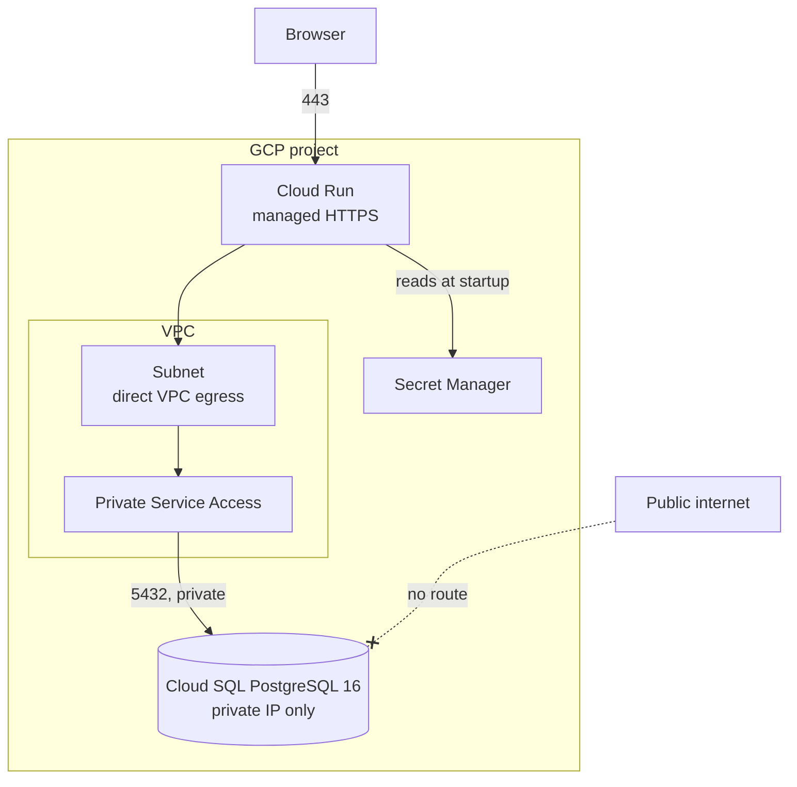

# Metabase and PostgreSQL on GCP

Terraform for Metabase on Cloud Run, backed by Cloud SQL for PostgreSQL with no
public IP.



## Requirements

| Requirement | Implementation |
|---|---|
| Provision with Terraform | 25 resources, 27 with the optional custom domain |
| Structure for Metabase and PostgreSQL | Cloud Run for the container, Cloud SQL for all state |
| PostgreSQL not reachable from public network | `ipv4_enabled = false`, so no public IP is ever assigned. `ssl_mode = ENCRYPTED_ONLY`. No `authorized_networks`. |
| Config and secret management | Config is Terraform variables. Secrets are generated into Secret Manager and read by Cloud Run at startup, so the value is not in the image or the service definition. |
| Usable over the web | Cloud Run serves HTTPS with a managed certificate |

## Why GCP

No cloud was specified, so this is a familiarity choice. Cloud Run maps to ECS Fargate
behind an ALB, Cloud SQL to RDS in private subnets.

## Why Cloud Run and not a VM

Cloud Run gives HTTPS with a managed certificate, no OS to patch, and scales to zero.
A VM is cheaper if Metabase runs all day.

| Option | USD/month |
|---|---|
| Cloud Run, `min_instances = 0` | 0 to 3 |
| `e2-medium` VM | ~28 |
| Cloud Run, `min_instances = 1` | ~114 |

On a VM the instance itself is short:

```hcl
resource "google_compute_instance" "metabase" {
  name         = "metabase"
  machine_type = "e2-medium"
  zone         = "${var.region}-b"

  boot_disk {
    initialize_params { image = "cos-cloud/cos-stable" }
  }

  network_interface {
    subnetwork = google_compute_subnetwork.main.id
    # no access_config, so no public IP
  }

  metadata = {
    gce-container-declaration = yamlencode({
      spec = { containers = [{ image = var.metabase_image, env = local.metabase_env }] }
    })
  }

  service_account {
    email  = google_service_account.metabase.email
    scopes = ["cloud-platform"]
  }
}
```

The VM then also needs Cloud NAT to pull the image without a public IP, a load
balancer with a managed certificate or Caddy on the box for TLS, and a managed
instance group to restart it on failure. Roughly 60 more lines.

Cloud Run suits occasional internal use. For a Metabase people use all day, a VM is
cheaper and has no cold start.

## Deploy

Terraform >= 1.6, `gcloud`, a project with billing enabled.

```bash
gcloud auth application-default login
cd part1-infrastructure
cp terraform.tfvars.example terraform.tfvars   # set project_id
terraform init && terraform apply
open "$(terraform output -raw metabase_url)"
```

12 to 18 minutes, almost all Cloud SQL. Terraform enables the APIs itself. First load
runs the schema migrations and takes 60 to 90 seconds.

Custom domain (optional): set `cloudflare_zone_id` and `custom_domain`, export
`CLOUDFLARE_API_TOKEN` with `Zone:DNS:Edit`. Creates a Cloud Run domain mapping and a
DNS-only CNAME to `ghs.googlehosted.com`. Proxying that record hides it from Google
and the certificate is never issued.

State is local by default. For shared use, create a versioned GCS bucket and uncomment
the backend block in `versions.tf`.

## Verify

```bash
# Healthy
curl -s "$(terraform output -raw metabase_url)/api/health"     # {"status":"ok"}

# No public IP
terraform output cloud_sql_public_ip                            # ""
gcloud sql instances describe "$(terraform output -raw cloud_sql_instance_name)" \
  --format="value(settings.ipConfiguration.ipv4Enabled,ipAddresses[].type)"
# False   PRIVATE

# Private address is unreachable from outside the VPC
nc -vz -w 5 "$(terraform output -raw cloud_sql_private_ip)" 5432   # times out

# Secrets are references, not values
gcloud run services describe metabase-dev --region asia-southeast1 --format=yaml \
  | grep -A4 MB_DB_PASS                                        # secretKeyRef
```

Locally. The `postgres` service publishes no ports:

```bash
docker compose -f local/docker-compose.yml up -d && open http://localhost:3000
```

## Assumptions

- One project. Real environments would use one project each.
- The Cloud SQL instance holds all Metabase state. Exporting dashboards between
  environments is a separate job, done with Metabase serialization.
- The brief asks for public access, so `allow_public_access` defaults to `true` and
  Metabase's own login is the only thing in front of the data. Set it `false` and use
  `invoker_members` to require IAM as well.

## Trade-offs

- Generated secrets end up in Terraform state. Restrict and encrypt the state bucket,
  or create the secrets separately and reference them by name.
- `cpu_idle = false`. Cloud Run gives CPU only during requests by default, which stops
  Metabase's scheduler from running between them.
- `min_instances = 0` costs almost nothing but adds a cold start. Production should
  use `1`.
- 4 GiB and 2 vCPU. At 2 GiB the container runs out of memory during the first schema
  migration, and Cloud Run requires 2 vCPU at 4 GiB.

Not included: remote state locking, a load balancer with IAP, `REGIONAL` Cloud SQL,
alerting, image pinned by digest.

## Destroy

```bash
terraform destroy
```

Cloud SQL keeps instance names reserved for about a week after deletion, which is why
the name has a random suffix.
