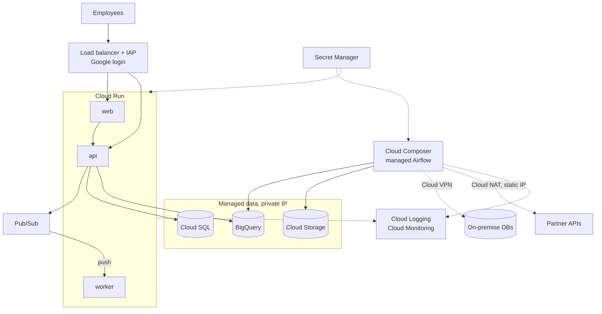

# Architecture

## System

| Service | Role |
|---|---|
| `web` | browser UI |
| `api` | REST for the UI and other internal systems |
| `worker` | async jobs, delivered by Pub/Sub push |
| `airflow` | scheduled data pipelines |

Three environments (dev, staging, prod). Some data sources are outside the cloud
account, including on-premise.

## Assumptions

1. Employees only. Nothing is reachable without signing in.
2. Small team. Managed services over self-hosted.
3. Tens to low hundreds of users.
4. GCP, for the same reason as Part 1. The design does not depend on it.

## Diagram

## Choices

**Cloud Run** runs `web`, `api` and `worker`, as in Part 1. Dev scales to zero.

Cloud Run only runs while it is handling a request, so `worker` cannot sit and watch a
queue. The API publishes to Pub/Sub, and Pub/Sub sends each message to the worker as an
HTTP request. Messages that fail are retried, then set aside after a fixed number of
attempts.

If `web` is a static build, it goes in a Cloud Storage bucket behind the load balancer
instead of on Cloud Run.

**Cloud Composer** runs Airflow in prod. Airflow's scheduler, database and workers have
to stay up, which Cloud Run does not do. Composer costs around USD 300 per month per
environment. Dev and staging share one small Airflow on a VM instead.

**Cloud SQL** on a private IP, as in Part 1.

**Identity-Aware Proxy** sits on the load balancer and requires a Google account before
a request reaches any service. No service handles sign-in itself. Each service still
checks what the user is allowed to see.

## Environments

One GCP project per environment: `app-dev`, `app-staging`, `app-prod`. Same Terraform,
different tfvars, separate state, the same pattern as the `environment` variable in
Part 1. Separate projects rather than name prefixes, because permissions, quotas and
billing are all set per project.

|  | dev | staging | prod |
|---|---|---|---|
| Deploy | automatic on merge | automatic after dev passes | manual approval |
| Cloud SQL | smallest tier, single zone | small, single zone | regional, with point-in-time recovery |
| Airflow | shared VM | shared VM | Cloud Composer |
| Data | synthetic | masked copy of prod | real |
| Alerts | none | Slack | Slack and on-call |

Access to dev and staging is broad, so neither holds real records. Staging uses a
masked copy so the data still behaves like production.

Infrastructure and application deploy separately. Terraform creates the projects,
databases, buckets and permissions. The application pipeline only deploys new
images.

## Configuration and secrets

| Type | Example | Where |
|---|---|---|
| Config | API URL, log level, instance count | Terraform variables per environment |
| Secret | database passwords, API keys | Secret Manager |

Cloud Run reads secrets from Secret Manager at startup, as in Part 1. The value never
appears in the image or the service definition. Airflow reads its database and API
credentials from Secret Manager rather than storing them in its own database.
Terraform state holds generated values. That bucket is restricted and encrypted.

## External connections

| Target | How |
|---|---|
| On-premise database | Cloud VPN into the environment's VPC, private routing only |
| Database in another cloud | VPN, or Private Service Connect where supported |
| Partner API over the internet | Cloud NAT with a reserved static IP per environment, so the partner can allowlist it |

Each environment uses its own credentials, read-only on the remote side where
possible.

## Reliability

**Health checks.** Each service exposes `/healthz` (the process is running) and
`/readyz` (it can reach its database and other services). Cloud Run uses both, as in
Part 1.

**Monitoring.** Cloud Run reports request count, errors and response time to Cloud
Monitoring on its own. Airflow reports failed DAGs and how long tasks take. A check
from outside calls `/readyz` on a schedule to catch DNS and certificate problems.

**Logging.** Services log JSON to stdout, which Cloud Logging collects. Kept 30 days,
copied to BigQuery for anything older.

**Alerting.** Alerts on server errors, slow responses, Cloud SQL connections and disk,
and failed DAG runs. Dev sends nothing, staging goes to Slack, prod also pages whoever
is on call. Each alert links to a page saying what to do.

**Backups.** Cloud SQL automated backups with point-in-time recovery. Restores are
tested in staging.
