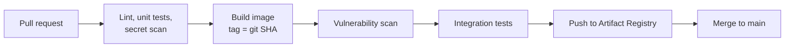
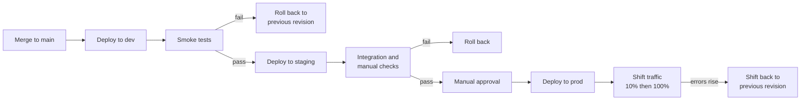
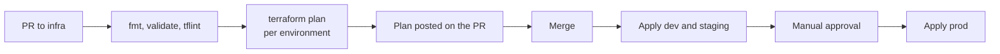

# CI/CD Pipeline

## Repositories

| Repo | Contains |
|---|---|
| `app-web`, `app-api`, `app-worker` | application source |
| `airflow-dags` | DAGs |
| `infra` | Terraform for all environments |

## CI

The image is built on the pull request and tagged with the commit SHA. The same tag is
deployed to every environment. Nothing is rebuilt between dev and prod.

GitHub Actions signs in to GCP with Workload Identity Federation. There is no service
account key file to download or leak.

## Deploy and promotion

Promoting means deploying the same image tag to the next environment. Prod is the only
manual step, approved through a GitHub Environment.

Prod deploys send 10% of traffic to the new revision first. Rolling back points traffic
at the previous revision.

## Infrastructure

The plan output goes on the pull request before anyone approves it. A one-line variable
edit can mean replacing a database.

- State: GCS bucket, one prefix per environment
- Applies run as that environment's service account, not a person's credentials
- A nightly plan catches anything changed by hand in the console

## Airflow DAGs

CI checks:

- every DAG file loads
- no two DAGs share an id
- no DAG queries a database at file load, since the scheduler reloads these files
  every few seconds

On merge, DAGs sync to the environment's bucket. Dev tracks `main`. Staging and prod
track a tag.

## Database migrations

Rolling back an image does not roll back a migration. Each release only adds:

1. Add a nullable column, and code that works without it.
2. Fill it in, then make it required.
3. Drop the old column.

Migrations run as a job before the new revision takes traffic. Take a backup first in
prod.

## Rollback

| Problem | Action |
|---|---|
| Bad release | send traffic to the previous Cloud Run revision |
| Bad DAG | revert the tag |
| Bad infrastructure change | revert the PR and apply |
| Bad migration | fix-forward migration, or restore from backup if data is damaged |
